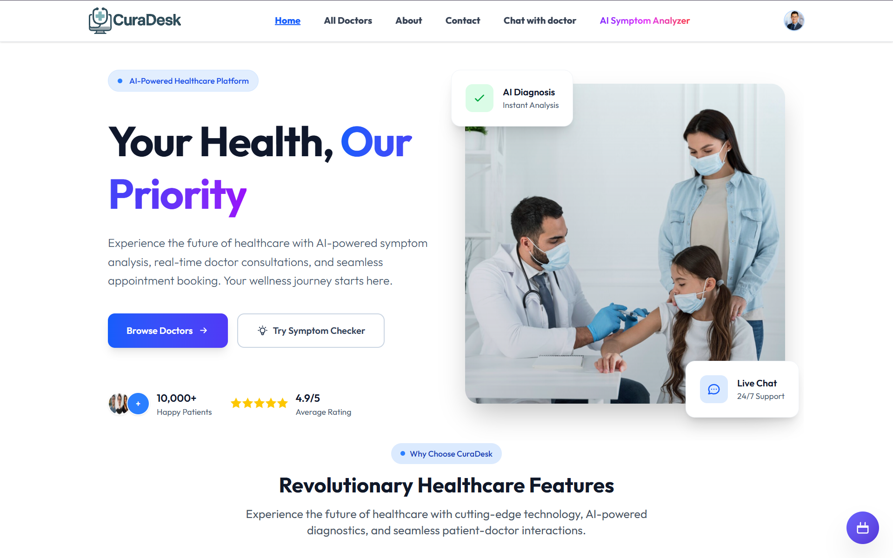
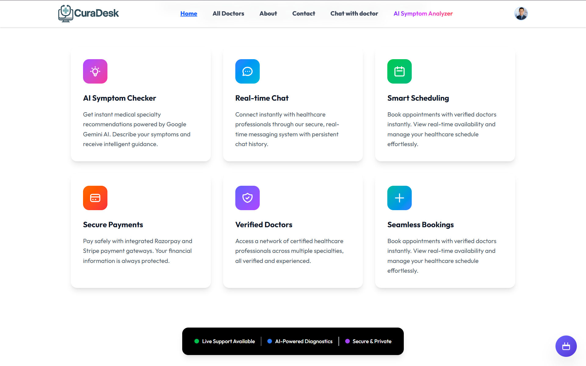
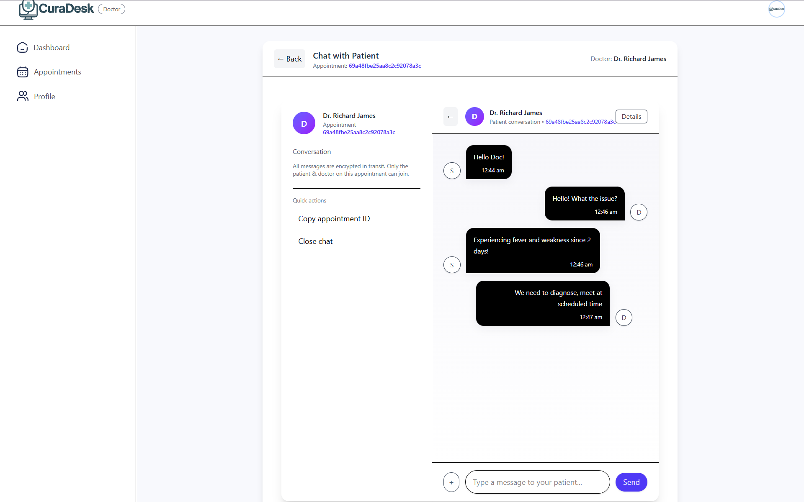
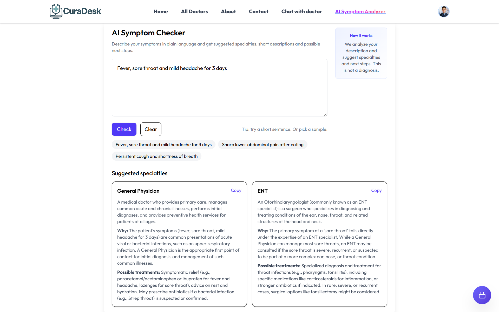
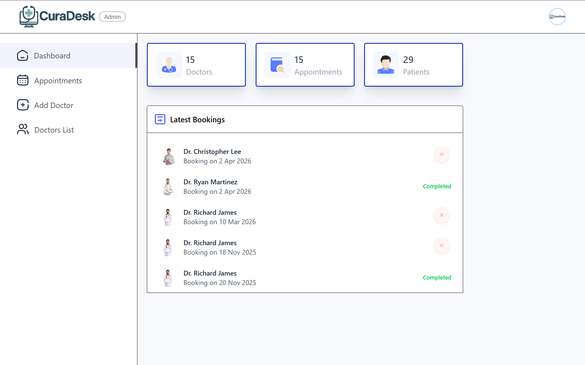

<!-- ================================================== -->
<!--                     CURADESK                      -->
<!-- ================================================== -->

<h1 align="center">🚀 CuraDesk</h1>

## 🛠️ Tech Stack


## 🎨 Frontend

<p align="center">
  
  
  
  
</p>

## ⚙️ Backend

<p align="center">
  
  
  
  
</p>

## 🗄️ Database

<p align="center">
  
</p>

<p align="center">
Reliable NoSQL database for scalable data storage and flexible schema design.
</p>

## 🚀 DevOps & Deployment

<p align="center">
  <a href="https://vercel.com/">
    
  </a>
  <a href="https://render.com/">
    
  </a>
</p>

<!-- If Dockerfile were present, would include Docker -->

---

## 🌐 Live Applications

<p align="center">
  
🔹 **[🚀 Client App](https://cura-desk-health-client.vercel.app)**  
🔹 **[⚙️ Backend Server](https://cura-desk-health-v2.onrender.com/)**  
🔹 **[🛡️ Admin Panel](https://cura-desk-health-admin.vercel.app)**  

</p>

> ⚠️ Backend may take 30–60 seconds to spin up due to cold start.

---

# 📖 Overview

CuraDesk is a modern full-stack healthcare management system built using the MERN stack.  

It follows a **monorepo architecture** with clearly separated layers:

- 🎨 Frontend (User Application)
- 🧠 Backend (Business Logic + API)
- 🛡️ Admin Dashboard (Management Interface)

The project is designed as:

- Real-world usage
- Clean separation of concerns  
- Maintainable code structure  

---

# 📸 Screenshots

## 🏠 User Interface

<p align="center">
  
</p>
<p align="center">
  
</p>

<p align="center">
Modern and responsive landing page built with React + Vite.
</p>

---

## 💬 Doctor–Patient Chat

<p align="center">
  
</p>

<p align="center">
Real-time secure communication between doctors and patients.
</p>

---

## 🤖 AI Symptom Analyzer

<p align="center">
  
</p>

<p align="center">
AI-powered symptom evaluation assisting users with preliminary health insights.
</p>

---

## 🛡️ Admin Dashboard

<p align="center">
  
</p>

<p align="center">
Centralized administrative panel for monitoring users and appointments.
</p>

---

# 🌟 Core Features

| Feature | Description |
|----------|------------|
| 💬 **Doctor–Patient Chat** | Communication channel enabling direct interaction between doctors and patients. |
| 🤖 **AI Symptom Analyzer** | Intelligent symptom-based prediction system assisting users with preliminary health insights. |
| 🔐 **JWT Authentication** | Secure token-based login with protected API routes. |
| 🛡️ **Role-Based Access Control** | Separate permissions and dashboards for users and admins. |
| ⚡ **Modular Monorepo Architecture** | Clean separation between frontend, backend, and admin for scalable development. |


## 🛡️ Admin Side
- Manage Users
- Monitor Appointments
- Data Control & Oversight
- Administrative Dashboard

## ⚙️ Backend
- RESTful API Architecture
- MongoDB Data Modeling
- Middleware-based Auth Protection
- Modular Route Handling

---

# 📁 Project Structure

```
CuraDesk/
│
├── admin/          # Admin dashboard
├── backend/        # Express API & business logic
├── frontend/       # Vite+React client application
├── package.json
└── package-lock.json
```

---

# 🚀 Local Development Setup

## 1️⃣ Clone Repository

```bash
git clone https://github.com/abhi-2560/CuraDesk-backup.git
cd CuraDesk-backup
```

---

## 2️⃣ Install Dependencies

### Backend

```bash
cd backend
npm install
```

### Frontend

```bash
cd ../frontend
npm install
```

---

## 3️⃣ Environment Variables

Create `.env` files in both `backend/` and `frontend/`.

### backend/.env

```ini
PORT=5000
MONGO_URI=mongodb://localhost:27017/curadesk_db
JWT_SECRET=your_secret_key
```

### frontend/.env

```ini
REACT_APP_API_URL=http://localhost:5000/api
```

---

## 4️⃣ Start Servers

### Start Backend

```bash
cd backend
npm run dev
```

### Start Frontend

```bash
cd frontend
npm start
```

Open in browser:

```
http://localhost:3000
```

---

# 📡 API Overview

Example REST Endpoints:

| Method | Endpoint | Description |
|--------|----------|------------|
| POST | `/api/auth/login` | User login |
| POST | `/api/auth/register` | User registration |
| GET  | `/api/users` | Fetch users |
| POST | `/api/appointments` | Book appointment |
| GET  | `/api/admin/stats` | Admin analytics |

---

# 🚀 Deployment

### Frontend
Deployed via **Vercel Git Integration**

### Backend
Can be deployed to:
- Render
- Railway
- AWS EC2
- Docker-based platforms

---

# 🔐 Security

- JWT Authentication
- Environment-based configuration
- Secure API routing
- Role-based access control

---

# 📈 Future Improvements Scope

- Notification System  
- Dockerization  
- CI/CD Pipeline  

---

# 🤝 Contributing

1. Fork the repository  
2. Create a feature branch  
3. Commit changes  
4. Submit Pull Request  


---

<div align="center">

## ⭐ If you found this project useful, give it a star!

Built with ❤️ by **abhi-2560**

</div>